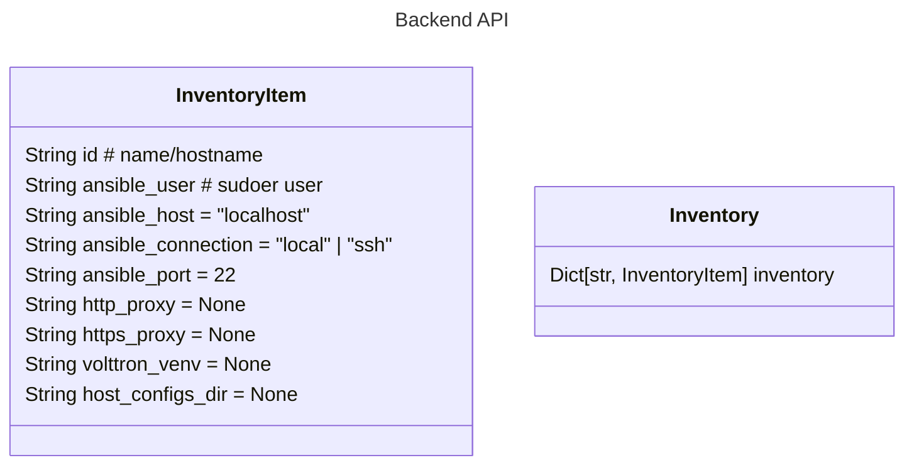

# Backend API Classes

```mermaid

---
title: Backend API
---

classDiagram

    class InventoryItem {
        String id # name/hostname
        String ansible_user # sudoer user
        String ansible_host = "localhost"
        String ansible_connection = "local" | "ssh"
        String ansible_port = 22
        String http_proxy = None
        String https_proxy = None
        String volttron_venv = None
        String host_configs_dir = None

    %%   ansible_user: vuzer
    %%   http_proxy: "http://squid-proxy.pnl.gov:3128"
    %%   https_proxy: "https://squid-proxy.pnl.gov:3128"
    %%   volttron_venv: "~/volttron23916.venv"
    %%   volttron_root: "~/volttron_23916"
    %%   volttron_home: "~/.volttron_23916"
    %%   volttron_git_organization: volttron
    %%   volttron_git_branch: "releases/8.1.1"
    %%   host_configs_dir: "~/.volttron_23916_configs"
    }

    class Inventory {
        Dict[str, InventoryItem] inventory
    }


%% classDiagram
%%     note "From Duck till Zebra"
%%     Animal <|-- Duck
%%     note for Duck "can fly\ncan swim\ncan dive\ncan help in debugging"
%%     Animal <|-- Fish
%%     Animal <|-- Zebra
%%     Animal : +int age
%%     Animal : +String gender
%%     Animal: +isMammal()
%%     Animal: +mate()
%%     class Duck{
%%         +String beakColor
%%         +swim()
%%         +quack()
%%     }
%%     class Fish{
%%         -int sizeInFeet
%%         -canEat()
%%     }
%%     class Zebra{
%%         +bool is_wild
%%         +run()
%%     }
```
